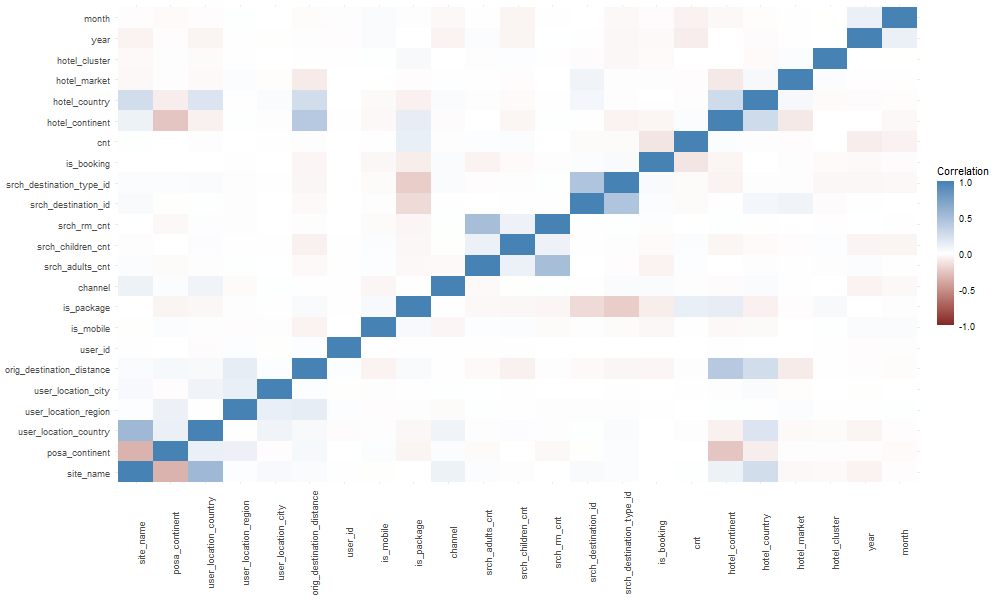
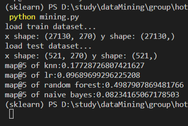

# “基于数据挖掘的酒店推荐”项目报告

> 李荣庆 3120215509
>
> 冯凯拓 1120181769
>
> 张成喆 1120181129
>
> 禹言江 3220211103

## 问题提出

在假期或是周末度假中，我们经常需要进行旅行。在旅行的目的地中，经常有数百甚至数千家酒店可供选择，我们很难知道哪家酒店适合我们的个人喜好。影响酒店偏好的因素有很多，包括酒店的环境，酒店的饮食，酒店的价格，个人的收入，个人的习惯等等。我们需要解决酒店的个性化推荐问题，给定一系列酒店，我们要求输出每个用户入住每个hotel_cluster的概率。

## 数据分析和可视化

由于此任务的目标是确定客户可能预订的hotel_cluster，因此我们需要查看hotel_cluster分布情况，具体分布情况可视化结果如下：

如图所示，分布虽然有些偏斜，但在 100 个不同的类中分布得相对平衡。

之后分析变量之间的相关性，观察可能有什么样的依赖关系，如下图所示：

从可视化结果看出，变量之间没有很强的线性依赖关系。

## 模型探索

分析样本各变量与分类结果的关系，如下表所示：

| 变量名                    | 关联性    |
| ------------------------- | --------- |
| site_name                 | -0.027497 |
| posa_continent            | 0.012180  |
| user_location_country     | -0.020239 |
| user_location_region      | 0.006927  |
| user_location_city        | 0.001241  |
| orig_destination_distance | 0.006084  |
| user_id                   | 0.003891  |
| is_mobile                 | 0.008788  |
| is_package                | 0.047598  |
| channel                   | -0.001386 |
| srch_adults_cnt           | 0.012407  |
| srch_children_cnt         | 0.014901  |
| srch_rm_cnt               | -0.005570 |
| srch_destination_id       | -0.016736 |
| srch_destination_type_id  | -0.036120 |
| is_booking                | -0.022898 |
| cnt                       | 0.000378  |
| hotel_continent           | 0.000422  |
| hotel_country             | -0.023837 |
| hotel_market              | 0.022149  |
| hotel_cluster             | 1.000000  |
| year                      | -0.000435 |
| month                     | -0.002142 |

显然，由表所示，参数中没有任何与分类结果（hotel_cluster）有强正（负）相关的东西。因此，线性模型可能不是这些预测的最佳选择。

在我们合并我们的训练和目的地数据集之前，我们需要考虑在预测酒店集群时哪些变量是关键的。根据 Kaggle 对变量的描述，以下特征是最重要的：

**srch_destination_id**:  酒店搜索目的地的 ID。 

**hotel_country**:  酒店所在的国家。

**hotel_market**:  酒店所在的市场区域.  

**hotel_cluster**:  酒店所属类别.  **这是我们要预测的值**  

**is_booking**:  如果预订了酒店，则为1，如果只是单纯点击，则为 0。

由于我们只对实际被预定的酒店感兴趣，因此我们可以从数据集中删除 is_booking==0 的样本，并只保留上述特征。

## 实验过程及选择

使用K近邻、逻辑回归、随机森林、朴素贝叶斯四种模型进行分类任务。

- **KNN**： KNN 是一个非参数模型，因此它可以很好地处理我们的非正态分布数据。目的是教模型根据最近k个邻居的数量预测正确的酒店集群。
- **逻辑回归**：上文的相关性矩阵表明线性预测模型可能不是我们数据的最佳选择。虽然逻辑回归被认为是一种线性方法，但当因变量是分类变量时，它的性能优于线性模型。
- **随机森林**：这也是一种非参数分类方法，由决策树模型演变而来，适用于非线性的情况，但方法容易过拟合。
- **朴素贝叶斯**：是以贝叶斯原理为基础，使用概率统计的知识对样本数据集进行分类，所需估计的参数很少，对缺失数据不太敏感，算法也比较简单。

具体评估指标如下：

​		我们使用平均精度（Mean Average Precision @ 5 ）去衡量模型效果，$MAP@5$如下式所示：

$$
MAP@5 = \frac{1}{|U|} \sum_{u=1}^{|U|} \sum_{k=1}^{min(5, n)} P(k)
$$
其中，$|U|$为用户事件数，$P(k)$为截止时刻$k$的精度，$n$为预测的酒店集群数。

## 挖掘结果和展示

由于数据集数据量较为庞大，且test.csv文件中没有标签信息，因此我们从train.csv中随机采样得到了部分样本作为测试集，并在剩余部分中进一步随机采样部分样本作为训练集。

最终分类结果如下：

## 结论

通过测试发现，随机森林效果最好、K近邻其次、逻辑回归和朴素贝叶斯效果较差。
